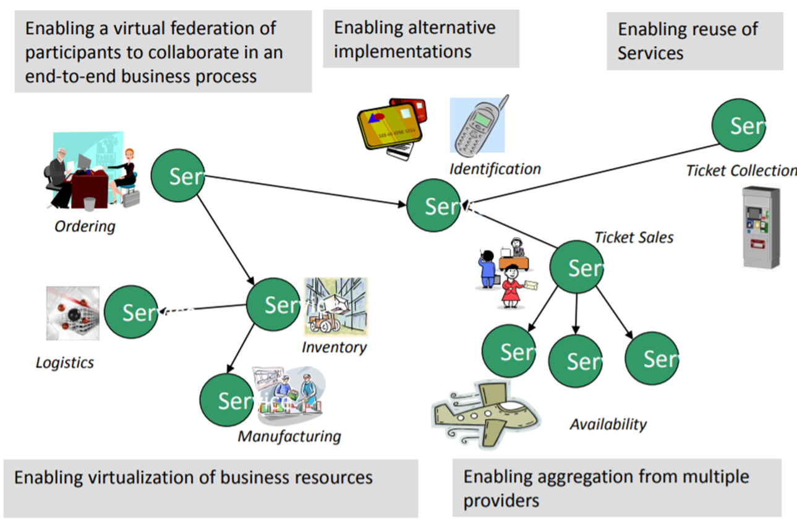
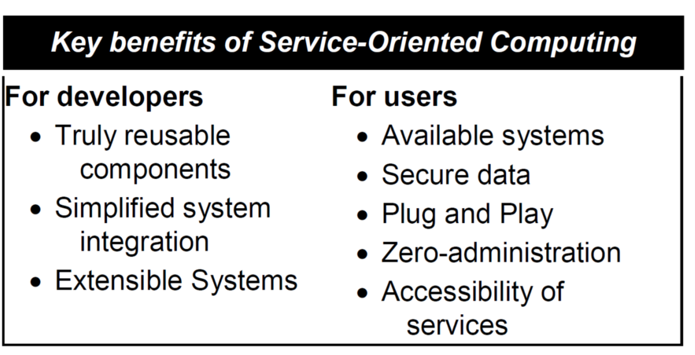

# Introduction

[TOC]

Service computing main concepts:

- Service
- Service computing
- Service oriented architecture

## 0 Summary

- Service computing is based on a premise that problems can be modelled in terms of the services.
- A service is a self-contained unit of software functionality, or set of functionalities, designed to complete a specific task such as retrieving specified information or executing an operation.
- Services represent a type of relationships-based interactions (activities) between at least one service provider and one service consumer to achieve a certain business goal or solution objective.

## 1 Service

Service (definition 1):

Services represent a type of relationships-based interactions (activities) between at least one **service provider** and one **service consumer** to achieve a certain business goal or solution objective.

---

Service (definition 2):

A service is a self-contained unit of software functionality, or set of functionalities, designed to complete a specific task such as retrieving specified information or executing an operation.

It contains the code and data integrations necessary to carry out a complete, discrete business function and can be accessed remotely and interacted with or updated independently.

## 2 Service computing

Service computing is based on a premise that problems can be modelled in terms of the services.

- Services Computing is a cross-discipline that covers the science and technology of bridging the gap between **business services and IT services**. 
- Supports integrating the business as linked, repeatable business tasks, or **services**.

---

Service computing importance:

- Why it all started – a bit of history, background of service orientation
- Importance to the community now – current benefits of service orientation
- Importance to you – why should you learn about it

### 2.1 Why it all started – a bit of history, background of service orientation

Towards Service Computing in an Enterprise:

#### 2.1.1 Main Frame

- A typical corporate or computer installation had
  - a suite of rooms, with a large, access-restricted, air-conditioned room for the computer 
  - a smaller quieter room for submitting jobs
- Nearby was a room full of keypunch machines for programmer use
- At that time, most computer programmers created, edited and stored their programs line by line on punch cards
  - a flexible write-once medium that encodes data
  - Groups or "decks" of cards form programs and collections of data
- Programmers submitted the program decks, to be read by the program, to a person working behind a counter in the computer room.
- It could take hours or days between submitting a job to the computing center and receiving the output.

---

- Main Frame - disadvantages - Computer 

  - Large

  - Too expensive too be owned by a single person

  - Operated by a highly skilled personnel

#### 2.1.2 Personal Computer

- Relatively small
- Can be afforded by individuals
- No high level skills needed to operate it

---

- Program code is deployed, executed and maintained **on the same machine** – many challenges - **maintenance**, **performance**, …
  - What if you need to make some changes to the database on multiple PCs?
    - maintenance problem
  - What if your program cannot run on limited hardware?
    - performance problem

#### 2.1.3 Client Server

The solution of maintenance problem is client-server model.

---

- A distributed application structure that partitions tasks or workloads between providers of the resource and requestors
- Program is **split into two parts**
  - Server – a provider of some function
  - Client – requestor of the function
- Client and server can be deployed on different machines
- Many clients can connect to one server
- Internet enabled server and client part of the program deployed on machines distributed across different networks
- More exciting applications became possible, not only in the enterprise domain

---

- But at the same time, the Internet exposed the limitations of client-server model in large scale dynamic environments, such as

  - Scalability issues

  - Mobility issues

  - …

#### 2.1.4 Service Orientation

Client-server vs service orientation:

- The traditional client-server model often lacks well-defined public contracts that are independent of the client or server implementation
  - this means a client is tied to a particular server
- In Service Computing
  - components publish and use services in a peer-to-peer manner 
  - a client is not tied to a particular server
  - service providers are interchangeable

- Traditional client-server – more coupled
  - The server exists for a specific client, without planning for re-use
- In service orientation – decoupling
  - the server side is very independent of the client
  - Many different client types use the same server
  - In this way SOA services are designed for reuse

---

Object orientation vs service orientation:

- Object oriented programming is built on the premise that programming problems can be modelled in terms of the objects in the problem domain
  - focuses on what things are and how they are constructed
- Service oriented programming adds the premise that problems can be modelled in terms of the services that an object provides or uses
  - focuses on what things can do

##### 2.1.5 Some more history – evolution of challenges in IT

- In the early days of computing, the challenge was to represent information in a machine-readable format that consisted of bits and bytes, called **data**.
- Over time, there was keen interest in complementing data with meaning, thus transforming it to **information**.
- With further advances in computing came the idea of adding reasoning to information, thus giving rise to **knowledge**.
- The need for higher levels of abstraction has recently led to the notion of adding action to knowledge, providing a way for knowledge to be useful, resulting in **services**.

### 2.2 Importance to the community now – current benefits of service orientation

- Benefits for enterprises
- Recent applications and underlying technologies

#### 2.2.1 Motivation - Enable flexible, federated business processes

#### 2.2.2 Service orientation in an Enterprise

- Enterprises (bank, aviation, restaurant )are made up of a set of Business Processes 
  - manufacture products 
  - buy and/or sell 
  - receive money 
  - issue invoices
  - pay staff 
  - …
- Most of these processes can be broken down into more fundamental discrete building blocks known as services.

#### 2.2.3 The goal of Service Computing

- Enable IT services and computing technology to perform business services more efficiently and effectively.
  - How to divide distributed systems to “services” which can be separately invoked through network requests and can provide independent functionalities
  - How to manage and evaluate existing services
  - How to reuse these services building more complex, composite services
  - How to assure quality of services

#### 2.2.4 Activities in a service lifecycle

- business componentization
- services modelling
- services creation
- services realization
- services annotation
- services deployment
- services discovery
- services composition
- services delivery
- service-to-service collaboration
- services monitoring
- services optimization
- services management

#### 2.2.5 Business benefits

- Built for partnerships
  - Standards based 
  - Business relationships expressed via service interactions 
  - Integration is driven by what is needed, not what is technically possible
- Agility - Built for change
  - Helps applications evolve over time and last 
  - Abstract the backend and replace over time 
  - Focusing on core-competencies 
  - Incremental implementation approach is supported 
  - Service Outsourcing – new business model!

#### 2.2.6 Technical Benefits

- Services Scale 
  - Build scalable, evolvable systems 
  - Scale down to mobile devices 
  - Scale up to for large systems or across organizations 
- Manage complex systems 
  - Does not require centralized services 
  - Empowers users with high end communication 
- Platform independent use 
- Loose Coupling allows flexibility

#### 2.2.7 Benefits for developers and users of service oriented systems

#### 2.2.8 Service computing applications

- Web applications
- Mobile applications
- Cloud systems
- Big data applications
- IoT Systems
- Blockchain systems
- Workflow systems
- Other distributed systems

#### 2.2.9 Underlying technologies

- Web services 
- Service-oriented architecture (SOA)
- Cloud computing
- Business process modelling
- ….

### 2.3 Importance to you – why should you learn about it

How can this course benefit you?

Where/when the service computing knowledge/skills/thinking will be needed?

## 3 Service oriented architecture

Service-oriented architecture (SOA) is a type of software design that makes software components reusable using service interfaces that use a common communication language over a network.

SOA integrates software components that have been separately deployed and maintained and allows them to communicate and work together to form software applications across different systems.
