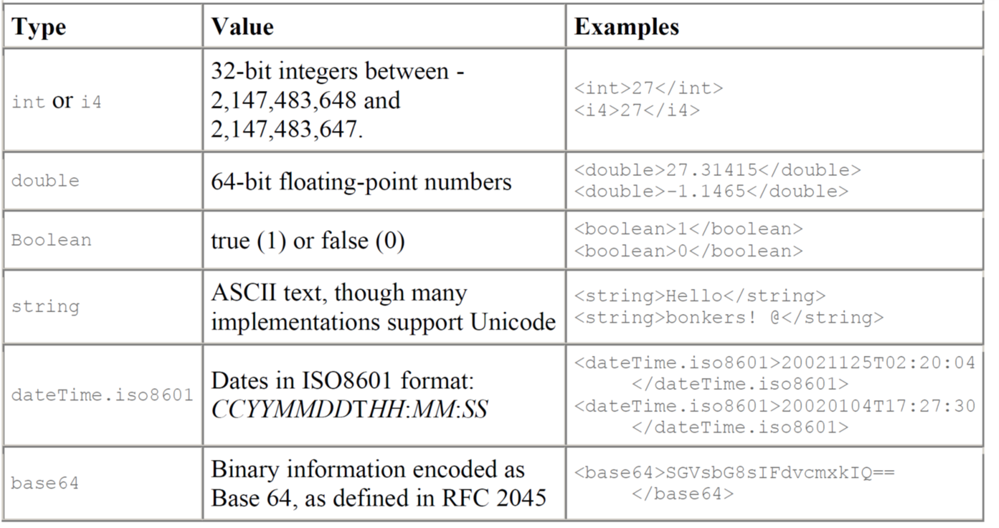

# Guided questions for Module 1

Introduction to Service Computing and XML-RPC

[TOC]

## 1 What is a service?

From introduction summary:

- Service computing is based on a premise that problems can be modelled in terms of the services.
- A service is a self-contained unit of software functionality, or set of functionalities, designed to complete a specific task such as retrieving specified information or executing an operation.
- Services represent a type of relationships-based interactions (activities) between at least one service provider and one service consumer to achieve a certain business goal or solution objective.

## 2 What is a web-service?

A Web Service is any service that:

- Is available over the Internet or private (intranet) **networks**

- Uses **a standardized XML messaging system**

- Is **not tied to any one operating system or programming language**

- Is **self-describing** via a common XML grammar

  Is **discoverable **via a simple find mechanism

## 3 What is a web-service protocol stack?

## 4 What is XML messaging?

Responsible for encoding messages in common XML format.

- **option 1: XML Remote Procedure Calls, XML-RPC**
- **option 2: Simple Object Access Protocol, SOAP**
- option 3: Custom XML

## 5 What is service description?

Responsible for describing an interface to a specific web service.

- Example: WSDL

## 6 What is service discovery?

Responsible for centralizing services into a common search registry.

- Example: UDDI

## 7 What is XML-RPC?

Protocol that uses XML messages to perform Remote Procedure Calls (RPC).

Platform independent;  diverse applications can talk to each other.

XML-RPC is the **easiest** way to get started with web services.

- Simpler than SOAP
- Simpler data structures for transmitting data

## 8 What is XML?

A markup language and file format for storing, transmitting, and reconstructing arbitrary data.

Markup language is a text-encoding system consisting of a set of symbols inserted in a text document to control its structure, formatting, or the relationship between its parts.

It defines a set of rules for encoding documents in a format that is both human-readable and machine-readable

## 9 What is SOAP?

used to stand for “Simple Object Access Protocol”

More information in Module 2.

SOAP is an XML-based protocol for exchanging information between computers.

Enables client applications to easily connect to remote services and invoke remote methods.

- For example, a client application can immediately add language translation to its feature set by locating the correct SOAP service and invoking the correct method.

Although SOAP can be used in a variety of messaging systems and can be delivered via a variety of transport protocols, the initial focus of SOAP is remote procedure calls transported via HTTP. 

## 10 What is WSDL?

WSDL: Web Service Description **Language**.

WSDL is an XML grammar for **specifying an interface** for a web service.

Specifies:

- **location** of web service

- **methods** that are available by the web service
- **data type** information for all XML messages

WSDL is commonly used to **describe SOAP services**.

---

Something about structure:

- **`<types>`: What data types will be transmitted?**
- **`<message>`: What messages will be transmitted?**
- **`<portType>`: What operations (functions) will be supported?**
- **`<binding>`: What SOAP specific details are there?**
- **`<service>`: Where is the service located?**

---

Given a WSDL file, a developer can immediately figure out **how to connect to the web service**.

Eases overall integration process.

Better yet, with WSDL tools, you can automate the integration…

## 11 What is UDDI?

UDDI:  Universal Description, Discovery and Integration.

Currently represents the **discovery** layer in the protocol stack.

Originally created by Microsoft, IBM and Ariba.

Technical specification for publishing and finding businesses and web services.

Two parts:

- Part I - Technical specification 
  - specification for building a distributed directory of businesses and services.
  - XML format for specifying businesses and services.
  - API for querying/publishing to the registry.
- Part II - Implementation
  - UDDI Business Registry, fully operational implementation of the specification.
  - Businesses can publish services here.
  - Businesses can discover services here.
  - Currently maintained by IBM, Microsoft, etc.

UDDI Data

- White Pages
  - Information about a specific company; name description, address, etc.
- Yellow Pages
  - Classification data for company or service.
  - For example: industry, product or geographic codes.
- Green Pages
  - Technical information about specific services.
  - Pointers to WSDL Files.

## 12 What is the relationship between XML, XML-RPC, and SOAP?

They are all in the "XML Messaging" layer of web-service protocol stack, being used to encode messages in XML format.

## 13 What is the relationship between SOAP, WSDL, and UDDI?

A client program finds services via UDDI,  then reads a WSDL document to understand what a Web service can do; then it uses SOAP to actually invoke the functions listed in the WSDL document.

## 14 What is the relationship between WSDL and service description?

service description: Responsible for describing an interface to a specific web service.

WSDL: WSDL is an XML grammar for **specifying an interface** for a web service.

## 14 What is the relationship between UDDI and service discovery?

service discovery: Responsible for centralizing services into a common search registry.

UDDI: Currently represents the **discovery** layer in the protocol stack. Technical specification for publishing and finding businesses and web services.

## 15 What are the three main actors in service architecture?

Three major roles in web services:

- Service Provider:  provider of the web service.
- Service Requestor:  any consumer of the web service.
- Service Registry:  logically centralized directory of services.

## 16 What are the steps in a typical development plan for a service requestor?

## 17 How do we develop web services from the service provider perspective?

## 18 What data types are defined in XML-RPC specification and how are they represented?

Basic data types in XML-RPC:

Complex data types in XML-RPC:

- Arrays 
  - represent sequential information,
- Structs
  - represent name-value pairs, much like hashtables, associative arrays, or properties

---

Representing basic types:

- All of the basic types are represented by simple XML elements whose content provides the value.

  - Example: to define a string whose value is "Hello World!":

    <string>Hello World!</string>

Representing arrays:

- Arrays are indicated by the **array** element, which contains a **data** element holding the list of values.
- Like other data types, the **array** element must be enclosed in a **value** element.

Representing structs:

- Structs contain unordered content, identified by name.
- **Names** are strings, though you don't have to enclose them in string elements. 
- Each **struct** element contains a list of **member** elements.
- **Member** elements each contain one **name** element and one **value** element.
- The order of members is not considered important.
- While the specification doesn't require names to be unique, you'll probably want to make sure they are unique for consistency.
- Structs can also contain other structs, or even arrays.

## 19 What elements are in XML-RPC request?

- A combination of XML content and HTTP headers
  - The XML content uses the data typing structure to pass parameters and contains additional information identifying which procedure is being called.
  - The HTTP headers provide a wrapper for passing the request over the Web.

---

- Each request contains a single XML document

  - root element is a **methodCall** element
  - each **methodCall** element contains a **methodName** element and a **params** element.
  - the **methodName** element identifies the name of the procedure to be called
  - the **params** element contains a list of parameters and their values. Each **params** element includes a list of **param** elements
  - **param** elements contain **value** elements

- The HTTP headers for these requests will reflect the senders and the content. The basic template looks like:

  

- The information in italics may change from client to client or from request to request.

## 20 What elements are in XML-RPC response?

- If the response is successful - the procedure was found, executed correctly, and returned results - then the XML-RPC response will look much like a request, except that the methodCall element is replaced by a methodResponse element and there is no methodName element:

  

- An XML-RPC response can only contain one parameter, despite the use of the enclosing params element. That parameter, may, of course, be an array or a struct, so it is possible to return multiple values.

- Even if your method isn't designed to return a value (void methods in C, C++, or Java, for instance) you still have to return something. A "success value" – for example a boolean set to true (1) - is a typical approach to getting around this limitation.

---

Fault response:

If there was a problem in processing the XML-RPC request, the methodResponse element will contain a fault element instead of a params element. The fault element, like the params element, has only a single value. Instead of containing a response to the request, however, that value indicates that something went wrong. 

## 21 How developer uses XML-RPC?

- Using XML-RPC in applications generally means adding an XML-RPC library and making some of the function calls through that library. 
- Creating functions that will work smoothly with XML-RPC requires writing code that uses only the basic types XML-RPC supports. 
- Adding XML-RPC support may require writing some wrapper code that connects the code with the library, but this generally isn't very difficult.
