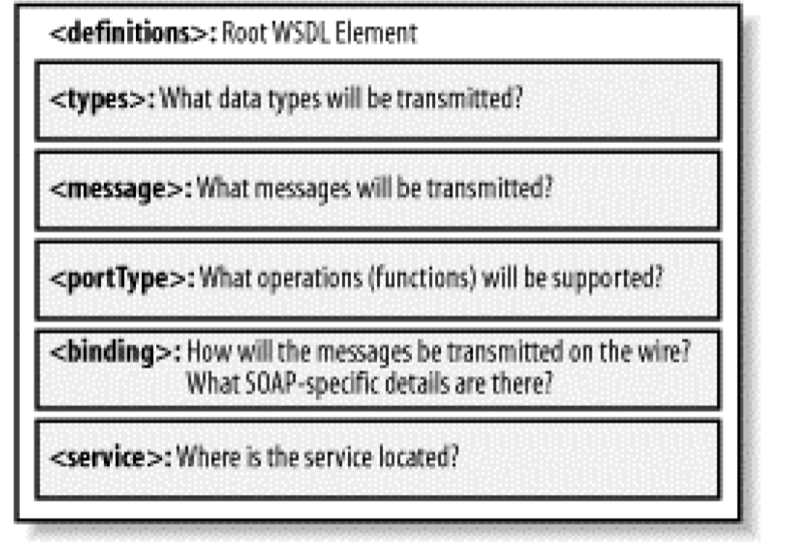

# Guided questions for Module 2

SOAP and WSDL

[TOC]

## 1 What is XML messaging?

From module 1.

Responsible for encoding messages in common XML format.

- **option 1: XML Remote Procedure Calls, XML-RPC**
- **option 2: Simple Object Access Protocol, SOAP**
- option 3: Custom XML

## 2 What is SOAP?

- SOAP is an XML-based protocol for exchanging information between computers.
- Enables client applications to easily connect to remote services and invoke remote methods
  - For example, a client application can immediately add language translation to its feature set by locating the correct SOAP service and invoking the correct method.
- Although SOAP can be used in a variety of messaging systems and can be delivered via a variety of transport protocols, the initial focus of SOAP is remote procedure calls transported via HTTP. 

## 3 ! What is the relationship between XML, XML-RPC, and SOAP?

They are all in the "XML Messaging" layer of web-service protocol stack, being used to encode messages in XML format.

## 4 What is advantage of SOAP over CORBA, DCOM, and Java RMI?

SOAP messages are written entirely in XML and are therefore uniquely **platform- and language-independent.**

## 5 What platform and language do we need to use with SOAP? (tricky question)

SOAP messages are written entirely in XML and are therefore uniquely platform- and language-independent.

So we don't need any particular platform or language to use with SOAP.

## 6 What are the major parts in SOAP specification?

The SOAP specification defines three major parts:

- SOAP envelope specification
- Data encoding rules
- RPC conventions

## 7 What are the main SOAP encoding rules?

To exchange data, computers must agree on rules for encoding specific data types.

SOAP therefore includes its own set of conventions for encoding data types. Most of these conventions are based on the W3C XML Schema specification.

## 8 ! What is WSDL?

- WSDL is a specification defining how to describe web services in a common XML grammar.

- WSDL describes four critical pieces of data:
  - Interface information describing all publicly available functions
  - Data type information for all message requests and message responses
  - Binding information about the transport protocol to be used
  - Address information for locating the specified service

---

- An XML-based interface description language
- Used for describing the functionality offered by a web service
- WSDL describes services as collections of network endpoints or ports

## 9 ! What is the relationship between WSDL and service description?

From Module 1.

service description: Responsible for describing an interface to a specific web service.

WSDL: WSDL is an XML grammar for **specifying an interface** for a web service.

## 10 ! What data does WSDL describe?

WSDL describes four critical pieces of data:

- Interface information describing all publicly available functions
- Data type information for all message requests and message responses
- Binding information about the transport protocol to be used
- Address information for locating the specified service

## 11 ! What is WSDL used for?

Used for describing the functionality offered by a web service.

## 12 What platform and language do we need to use with WSDL? (tricky question)

WSDL is platform- and language-independent.

So we don't need any particular platform or language to use with WSDL .

## 13 ! What are the major elements of WSDL?



## 14 ! Can you identify abstract and concrete parts of an example WSDL document?


## 15 ! Do you know what operations are available in this web service?

Read the abstract part of WSDL files.

The `<portType>` element of a WSDL file describes the operations that can be performed and the messages involved.

e.g:

```XML
    <message name="GetLastTradePriceInput">
        <part name="body" element="xsd1:TradePriceRequest"/>
    </message>
<message name="GetLastTradePriceOutput">
        <part name="body" element="xsd1:TradePrice"/>
    </message>
    <portType name="StockQuotePortType">
        <operation name="GetLastTradePrice">
           <input message="tns:GetLastTradePriceInput"/>
           <output message="tns:GetLastTradePriceOutput"/>
        </operation>
    </portType>
</definitions>
```

## 16 ! What is the relationship between SOAP, WSDL and UDDI?

From Module 1.


A client program finds services via UDDI;  then reads a WSDL document to understand what a Web service can do; then it uses SOAP to actually invoke the functions listed in the WSDL document.
