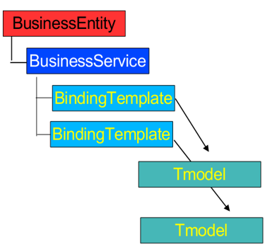

# Guided questions for Module 3

UDDI and BPEL

[TOC]

## 1 ! What is service discovery?

- Automatic detection of devices and services offered by these devices on a computer network
- Requires a common language to allow software agents to make use of one another’s services
- Web Services Discovery 
  - provides access to software systems over the Internet using standard protocols
  - the process of finding suitable web services to a given task

## 2 ! What is UDDI?

UDDI(Universal Description, Discovery, and Integration) defines a scheme to publish and discover information about Web services.

---

- A project to speed interoperability and adoption for web services
  - Standards-based specifications for service description and discovery
  - Shared operation of a business registry on the web
- Partnership among industry and business leaders

---

- **Programmatic registration and discovery of business entities and their Web services**
- Based on SOAP, HTTP, XML
- Registry data
  - Business registrations
  - Service type definitions

## 3 What is the relationship between XML, SOAP and UDDI?

UDDI is based on SOAP and XML. UDDI runs "over" SOAP.

## 4 What are the technical aspects of UDDI?

Data model is one of the technical aspects.

In our discussion on UDDI we did not study many details, as this technology is not commonly used nowadays.

For the purpose of the examination, regarding UDDI, the technical details will not be included.

## 5 ! What are the main uses of UDDI?

- Tool building client (Service Consumer)
  - Browse or search registry
  - Create a service proxy
- Tool publishing the service
  - Generates WSDL
  - Construct UDDI entries
- Application that needs dynamic binding
  - Directly access UDDI
  - Query can be pre-generated

## 6 Can you explain the UDDI data model in details?

- UDDI includes an XML Schema that describes four core types of information:
  - businessEntity
    - About the actual business, e.g. business name, etc.
  - businessService
    - About the services provided by the business
  - bindingTemplate
    - About how and where to access a specific service
  - tModel (Technical Model)
    - Include descriptions and pointers to external technical specifications or taxonomies

## 7 How to search UDDI via web based interface?

Can't find answer in the slide, try to answer with the help of new Bing.

You can search UDDI via a web-based interface using a UDDI Directory Explorer. For example, WebLogic provides a web-based UDDI Directory Explorer that lets you search and browse any UDDI registry on the Web, including any private UDDI registries running on WebLogic.

## 8 How to use the UDDI programmatic API?

Can't find answer in the slide, try to answer with the help of new Bing.

You can use the UDDI programmatic API to locate and obtain details on entries in the UDDI registry. The UDDI API set can be split by typical use case into two parts: the Inquiry API set and the Publication API set. The Inquiry API set is used to locate and obtain details on entries in the UDDI registry, while the Publication API set is used to publish and update information in the UDDI registry.

## 9 How to publish new companies and services to UDDI?

Can't find answer in the slide, try to answer with the help of new Bing.

The owners of web services can publish them to a UDDI registry. Once published, the UDDI registry maintains pointers to the web service description and to the service. You can publish a web service to UDDI from a registered source by navigating to the Registered Sources and Services page, selecting the source row in the Sources table, and then clicking Publish to UDDI . In the Publish Service to UDDI window, you can enter information about the service to be published.

## 10 ! What is service composition?

- Service composition allows developers to “compose” services that exchange SOAP messages and define their interfaces into an aggregate solution. 
- The aggregate is a composed Web service or a so-called composite Web service.

## 11 ! What is business process?

- Business companies are driven by underlying business processes
- Business process is a set of activities that are coordinated to achieve a certain business goal.
- Business process is a structured and measurable set of activities that consume certain resources and are designed to produce the specified output for a particular business requirement.

## 12 What is BPEL?

- The Business Process Execution Language for Web Services is such a flow representation developed to facilitate coordination of Web services into a comprehensive business process.
- In short: BPEL is a business process language that can be used to represent composite services. 

## 13 How to create the business process in BPEL?

In slide, I just saw an example.

Can't find answer in the slide, try to answer with the help of new Bing.

To create a BPEL process, you can follow these steps:
1. Switch to the Business Integration view.
2. To create a default business process, from the main menu, click File > New > BPEL Process.
3. To create a new process from scratch: Browse to an existing module (or click New to create one), and then specify a folder (optional) and a name for the new process, and click Next.

You can find more detailed information on creating a BPEL process on the IBM website.

## 14 What is the basic structure of BPEL document?

BPEL definition sections:

- Partner link definition
- Variables
- Process definition
  - invoke
  - reply

## 15 Why UDDI failed?

UDDI (Universal Description, Discovery, and Integration) was designed to be a universal business registry for web services. The idea was to use a standard mechanism for online interaction between SOA businesses components.

However, UDDI relied on a standards-based mechanism to classify, catalog and manage web services no matter the type of business. Businesses needed to adopt this complex standard and all talk the same language to be able to discover each other on the web. It was a very hard thing to do and UDDI failed.

While public UDDI is considered dead, it managed to survive in private registries inside enterprises.
