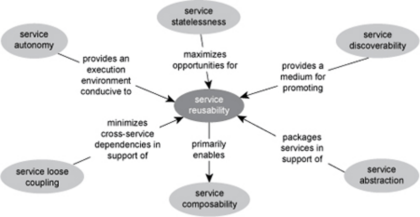

# Guided questions for Module 5

Service Oriented Architecture

[TOC]

## 1 What does the “service oriented” concept mean?

Can't find answer in the slide, try to answer with the help of new Bing.

Service-oriented is a design paradigm for computer software in the form of services.

## 2 ! What is a service oriented architecture?

A style of software design where services are provided to the other companies by application components, through a communication protocol over a network.

---

Service-Oriented Architecture (SOA) is a set of principles and methodologies for **designing and developing software in the form of interoperable services**. 

These services are well-defined business functionalities that are built as software components that can be reused for different purposes.

## 3 ! What are services within SOA?

= SOA Service:

- A discrete unit of functionality that can be accessed remotely and acted upon and updated independently.
- A repeatable task, for example:
  - Open an account
  - Perform a credit check
  - retrieving a credit card statement online

## 4 What is a business process?

From Module 3.

- Business companies are driven by underlying business processes
- Business process is a set of activities that are coordinated to achieve a certain business goal.
- Business process is a structured and measurable set of activities that consume certain resources and are designed to produce the specified output for a particular business requirement.

## 5 How is a service related to a business process?

Can't find answer in the slide, try to answer with the help of new Bing.

A service is related to a business process in that it is a series of activities performed to deliver a service to customers. The term is often used in manufacturing and logistics to describe how raw materials are transformed into finished products, but it is mostly used in customer-facing activities, such as providing professional services, delivering food orders, etc.

Business process management (BPM) employs methods to discover, model, analyze, measure, improve and optimize business strategy and processes.

## 6 How services relate to each other within SOA?

Can't find answer in the slide, try to answer with the help of new Bing.

SOA, or service-oriented architecture, defines a way to make software components reusable and interoperable via service interfaces.

Services use common interface standards and an architectural pattern so they can be rapidly incorporated into new applications.

SOA promotes loose coupling between software components so that they can be reused.

Applications in SOA are built based on services. A service is an implementation of a well-defined business functionality.

## 7 How services communicate?

Can't find answer in the slide, try to answer with the help of new Bing.

In a service-oriented architecture (SOA), services communicate with each other via service interfaces.

These interfaces define how a service provider will perform requests from a service consumer.

The interface of a service is separate from its implementation, so a service provider can execute a request without the service consumer knowing how it does so; the service consumer only worries about consuming services.

Services use common interface standards and an architectural pattern so they can be rapidly incorporated into new applications.

## 8 How services are designed?

Can't find answer in the slide, try to answer with the help of new Bing.

New Bing answer the same as question 7!

## 9 ! What are the principles of service-orientation? Do you understand them in details?

Service Design Principles:

The principles of service-orientation provide a means of supporting and achieving a foundation paradigm based upon building of SOA characteristics.

Common Service Design Principles:

- Standardized Service Contracts
- Loose Coupling
- Abstraction
- Reusability
- Autonomy
- Statelessness
- Discoverability
- Composability

Details are in the slide.

## 10 What are characteristics of contemporary SOA?

Any function can be a service but need not be. The criteria for whether a function needs to be a service is based on **its reuse potential**.

## 11 ! What are the benefits of SOA?

- ENABLE FLEXIBLE, FEDERATED BUSINESS PROCESSES
- Business benefits:
  - decreased cost
  - increased productivity
  - partnership
  - agility
- Technical Benefits:
  - Services Scale
  - Manage complex systems
  - Platform independent use
  - Loose Coupling allows flexibility

## 12 ! What are the pitfalls/challenges of adopting SOA? When not to use SOA?

Applying SOA - Challenges:

- Service Orientation
  - Business functionality has to be made available as services. Service contracts must be fixed.
- Reuse
  - Implemented services must be designed with reuse in mind. This creates some overhead.
- Sharing of Responsibilities
  - Potential service users must be involved in the design process and will have influence on the service design.
- Increased complexity!

---

When not to use SOA?

- When you have homogenous IT environment
- When real time performance is critical
- When tight coupling is a pro not a con
- When things don’t change

## 13 How service orientation applies to the enterprise?

Can't find answer in the slide, try to answer with the help of new Bing.

## 14 How service orientation principles inter-relate?

Can reusability be affected by applying other principles?

- Service autonomy
- Service statelessness
- Service abstraction
- Service discoverability
- Service loose coupling

---

Will applying the principle of reusability have impact on any other principle?

- Service composability

---

## 15 ! How Web services support service orientation principles?

Service-oriented architecture can be implemented with web services.

- Functional building blocks are accessible over standard internet protocols.
  - Independent of platforms and programming languages.
- Web services can represent:
  - New applications
  - Wrappers around existing legacy systems.