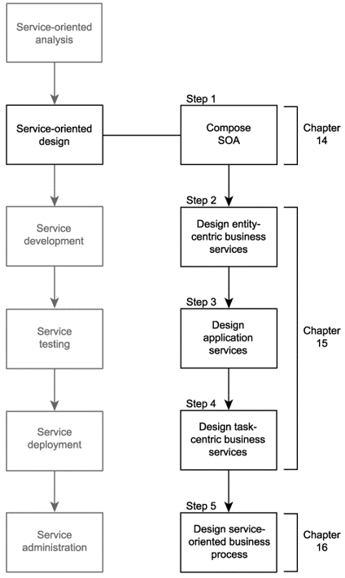
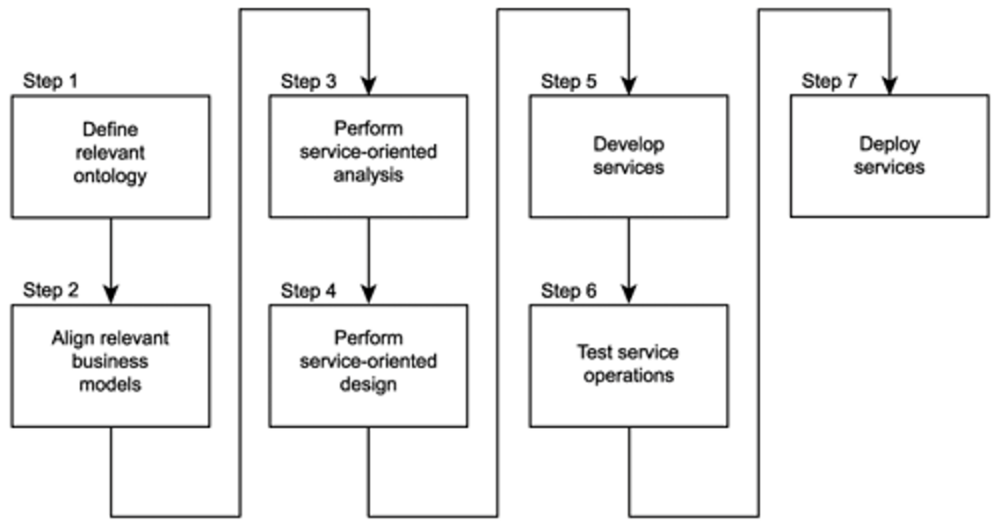
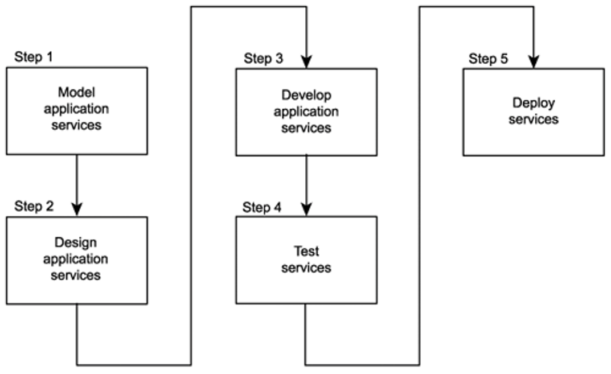
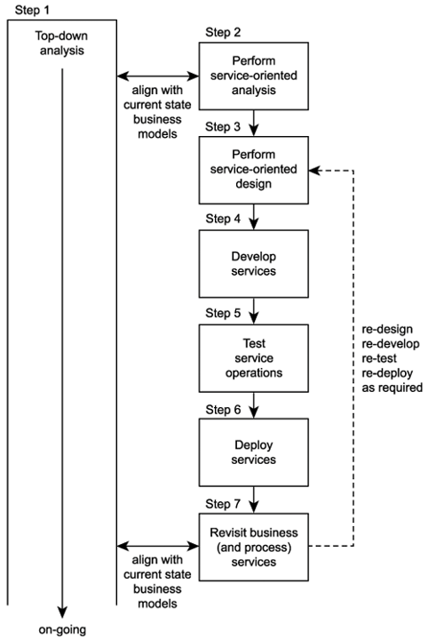

# Module 6 Main Concept

Service Engineering

Service Engineering

[TOC]

## 1 Service Engineering

- also called service-oriented software engineering
- a software engineering process that attempts to **decompose the system into self-running units that either perform services or expose services**

## 2 SOA lifecycle

- **A series of steps that need to be completed to construct the services** for a given service-oriented solution.
- The basic SOA lifecycle consists of a series of phases similar to those used for regular development projects.
- SOA introduces unique considerations in every phase of service construction and delivery.

---

Common phases of an SOA delivery lifecycle:

### 2.1 Service-oriented analysis

- In this initial stage that we determine the potential scope of our SOA
- Service layers are mapped out
- Individual services are modeled as **service candidates** that comprise a preliminary SOA

The service-oriented analysis phase is probably the most important part of our SOA delivery lifecycle.

---

Service-oriented analysis objectives 略

---

Service-oriented analysis goals:

- Define a preliminary set of **service operation candidates**.
- Group service operation candidates into logical contexts. These contexts represent **service candidates**.
- Define preliminary **service boundaries** so that they do not overlap with any existing or planned services.
- Identify encapsulated logic with **reuse** potential.
- Ensure that the context of **encapsulated** logic is appropriate for its intended use.
- Define any known preliminary **composition** models.

---

#### 2.1.1 Step 1: Define business automation requirements

定义业务自动化需求

- **Business requirements** documentation is required for this analysis process to begin.
- Only requirements related to the scope of a service-oriented solution should be considered.
- This business process documentation will be used as the starting point of the service modeling process described in Step 3.

- **业务需求**文件是开始此分析过程所必需的。
- 只考虑与面向服务的解决方案的范围相关的需求。
- 此业务流程文档将用作步骤 3 中描述的服务建模流程的起点。

#### 2.1.2 Step 2: Identify existing automation systems

识别现有的自动化系统

- Gain an understanding of affected **legacy environments**
- Existing application logic that is already automating any of the requirements identified in Step 1 needs to be identified
- This information will be used to help identify application service candidates during the service modeling process described in Step 3

- 了解受影响的遗留环境
- 需要识别已经自动化步骤 1 中确定的任何需求的现有应用程序逻辑
- 此信息将用于在步骤 3 中描述的服务建模过程中帮助识别应用程序候选服务

#### 2.1.3 Step 3: Model candidate services

建模候选服务

- **Service operation candidates** are identified and then grouped into a logical context
- These groups eventually take shape as **service candidates**
  - they are then further assembled into a tentative composite model representing the combined logic of the planned service-oriented application

- **识别服务操作候选**，然后将其分组到逻辑内容中
- 这些组最终形成**服务候选**
- 然后将它们进一步组装到一个暂定的组合模型中，该模型表示计划的面向服务的应用程序的组合逻辑

---

Service Modelling:

- A service modeling process - organizing the information we gathered in Steps 1 and 2 of the service-oriented analysis process
- This process can be structured in many different ways
- We will provide some guidelines that can be used to customize the process to fit within organization's existing business analysis platforms and procedures

服务建模：

- 服务建模过程-组织我们在面向服务的分析过程的步骤 1 和步骤 2 中收集的信息
- 这个过程可以用许多不同的方式来组织
- 我们将提供一些指导方针，可用于定制流程，以适应组织现有的业务分析平台和流程

---

Common steps of modeling process

##### 2.1.3.1 Step 1: Decompose the business process

分解业务流程

Take the documented business process and break it down into a series of granular process steps.

采用文档化的业务流程，并将其分解为一系列细粒度流程步骤。

---

- Input: **business process document** 业务流程文档
- Output: **decomposed business process** 分解的业务流程

##### 2.1.3.2 Step 2: Identify business service operation candidates

识别业务服务操作候选

- Some steps within a business process can be easily identified as not belonging to the potential logic that should be encapsulated by a service candidate
  - **Manual process** steps that cannot or should not be automated
  - Process steps performed by existing legacy logic for which service candidate encapsulation is not an option
- By filtering out these parts we are left with the processing steps most relevant to our service modeling process.

- 业务流程中的一些步骤很容易被识别为不属于应该由服务候选封装的潜在逻辑
- 不能或不应该自动化的手动流程步骤
- 处理由现有遗留逻辑执行的步骤，其中服务候选封装不是一个选项
- 通过过滤掉这些部分，我们只剩下与服务建模过程最相关的处理步骤。

---

- Input: **decomposed business process** 分解业务流程

- Output: **business service operation candidates**: 业务服务操作候选

  filtered out decomposed business process with some steps identified as not belonging to the service oriented solution and others identified as possible service operation candidates
  
  过滤出分解的业务流程，其中一些步骤被标识为不属于面向服务的解决方案，其他步骤被标识为可能的服务操作候选

##### 2.1.3.3 Step 3: Abstract orchestration logic

抽象业务流程逻辑

- If the decision was made to not incorporate an orchestration service layer - then skip this step
- If it was decided to build an **orchestration layer** as part of the SOA, then we should identify the parts of the processing logic that this layer would abstract
- Potential types of logic suitable for this layer include:
  - business rules
  - conditional logic
  - exception logic
  - sequence logic

- 如果决定不合并业务流程服务层，则跳过此步骤
- 如果决定构建一个编排层作为 SOA 的一部分，那么我们应该确定该层将抽象的处理逻辑部分

- 适合此层的潜在逻辑类型包括：

  - 业务规则

  - 条件逻辑

  - 异常逻辑

  - 顺序逻辑

##### 2.1.3.4 Step 4: Create business service candidates

创建业务服务候选

- Review the processing steps that remain after we completed step 2 and determine one or more logical contexts with which these steps can be grouped.
- Each context represents a service candidate.
- In this step, we can also add additional service operation candidates not required by the current business process, but added to round out entity services with a complete set of reusable operations.

- 回顾我们完成步骤 2 后剩下的处理步骤，并确定一个或多个逻辑内容，这些步骤可以与之分组。
- 每个内容代表一个候选服务。
- 在此步骤中，我们还可以添加当前业务流程不需要的其他服务操作候选，但添加这些操作是为了使用完整的可重用操作集来完善实体服务。

---

- Input: **business service operation candidates** 业务服务操作候选

- Output: **business service candidates**: 业务服务候选

  business service operation candidates grouped into one or more logical contexts
  
  将业务服务操作候选分组到一个或多个逻辑内容中

##### 2.1.3.5 Step 5: Refine and apply principles of service-orientation

完善和应用面向服务的原则

- So far we have just grouped processing steps derived from an existing business process
- To make our service candidates truly worthy of an SOA, we must take a closer look at the underlying logic of each proposed service operation candidate
- In this step we will make adjustments by applying key service-orientation principles
  - reusability
  - autonomy

- 到目前为止，我们只是对来自现有业务流程的处理步骤进行了分组
- 为了使我们的候选服务真正配得上 SOA，我们必须仔细研究每个提议的候选服务操作的底层逻辑
- 在此步骤中，我们将通过应用关键的面向服务原则进行调整
  - 可重用性
  - 自治

---

- Input: **business service candidates**: 业务服务候选

  business service operation candidates grouped into one or more logical contexts

  将业务服务操作候选分组到一个或多个逻辑内容中

- Output: **revised business service candidates** (after applying key service-orientation principles: reusability, autonomy)

  **修订的业务服务候选**（在应用关键的面向服务原则：可重用性、自主性之后）

##### 2.1.3.6 Step 6: Identify candidate service compositions

识别候选服务组合

- Identify a set of the most common scenarios that can take place within the boundaries of the business process.
- For each scenario, follow the required processing steps as they exist now.
- This exercise accomplishes the following:
  - It gives you a good idea as to how appropriate the grouping of your process steps is.
  - It demonstrates the potential relationship between orchestration and business service layers.
  - It identifies potential service compositions.
  - It highlights any missing workflow logic or processing steps.
- Ensure that as part of your chosen scenarios you include failure conditions that involve exception handling logic. Note also that any service layers you establish at this point are still preliminary and still subject to revisions during the design process.
- 确定一组可能在业务流程边界内发生的最常见场景。
- 对于每个场景，按照所需的处理步骤执行。
- 这项工作的目的如下：
  - 它让你很好地了解流程步骤的分组是否合适。
  - 它展示了编排层和业务服务层之间的潜在关系。
  - 识别潜在的服务组合。
  - 它突出显示任何缺失的工作流逻辑或处理步骤。

- 确保在您选择的场景中包含包含异常处理逻辑的故障条件。还要注意，此时建立的任何服务层仍然是初步的，在设计过程中仍然需要进行修订。

---

- Input: revised service candidates 修订的业务服务候选
- Output: Candidate service compositions 候选服务组合

##### 2.1.3.7 Step 7: Revise business service operation grouping

修改业务服务操作分组

- Based on the results of the composition exercise in Step 6, revisit the grouping of your business process steps and revise the organization of service operation candidates as necessary.
- It is not unusual to consolidate or create new groups (service candidates) at this point.

- 基于步骤 6 中组合的结果，重新审视业务流程步骤的分组，并根据需要修改服务操作候选的组织。
- 在这一点上合并或创建新的组（候选服务）并不罕见。

##### 2.1.3.8 Step 8: Analyze application processing requirements

分析应用处理需求

- Optional and more suited for complex business processes and larger service-oriented environments
- Requires to more closely study the underlying processing requirements of all service candidates to abstract any further technology-centric service candidates from this view that will complete a preliminary application services layer.
- To accomplish this, each processing step identified so far is required to undergo a mini-analysis.
- Specifically, what needs to determined is:
  - What underlying application logic needs to be executed to process the action described by the operation candidate.
  - Whether the required application logic already exists or whether it needs to be newly developed.
  - Whether the required application logic spans application boundaries. In other words, is more than one system required to complete this action?
- 可选的，更适合复杂的业务流程和更大的面向服务的环境
- 需要更仔细地研究所有候选服务的底层处理需求，以便从该视图中抽象出任何进一步以技术为中心的候选服务，从而完成初步的应用程序服务层。
- 要做到这一点，到目前为止确定的每个处理步骤都需要进行小型分析。
- 具体来说，需要确定的是:
  - 需要执行哪些底层应用程序逻辑来处理候选操作所描述的操作。
  - 所需要的应用逻辑是否已经存在，或者是否需要重新开发。
  - 所需的应用逻辑是否跨越应用边界。换句话说，是否需要多个系统来完成此操作？

##### 2.1.3.9 Step 9: Identify application service operation candidates

识别应用程序服务候选操作

- Break down each application logic processing requirement into a series of steps.

- Be explicit about how you label these steps so that they reference the function they are performing.

- 将每个应用程序逻辑处理需求分解为一系列步骤。
- 明确说明如何标记这些步骤，以便它们引用它们正在执行的功能。

##### 2.1.3.10 Step 10: Create application service candidates

创建应用程序候选服务

- Group these processing steps according to a predefined context.
- With application service candidates, the primary context is a logical relationship between operation candidates.
- This relationship can be based on any number of factors, including:
  - association with a specific legacy system
  - association with one or more solution components
  - logical grouping according to type of function
- 根据预定义的内容对这些处理步骤进行分组。
- 对于候选应用程序服务，主内容是候选操作之间的逻辑关系。
- 这种关系可以基于任何数量的因素，包括：
  - 与特定遗留系统的关联
  - 与一个或多个解决方案组件的关联
  - 根据功能类型进行逻辑分组

##### 2.1.3.11 Step 11: Revise candidate service compositions

修改候选服务组合

- Revisit the original scenarios identified in Step 5 and run through them again.
- Incorporate the new application service candidates as well.
- This will result in the mapping of elaborate activities that bring to life expanded service compositions.

- 重新审视步骤 5 中确定的原始场景，并再次运行它们。
- 合并新的候选应用程序服务。
- 这将导致复杂活动的映射，从而实现扩展的服务组合。

##### 2.1.3.12 Step 12: Revise application service operation grouping

修改应用服务操作分组

This step is optional

### 2.2 Service-oriented design

- When we know what it is we want to build, we need to **determine how it should be constructed**.
- Service-oriented design is a heavily **standards-driven phase** that incorporates industry conventions and **service-orientation principles** into the service design process.
- This phase, therefore, confronts service designers with key decisions that establish the hard logic boundaries encapsulated by services. The service layers designed during this stage can include the orchestration layer, which results in a formal business process definition.

Service-oriented design is the process by which **concrete physical service designs** are derived from logical service candidates and then assembled into abstract compositions that implement a business process.

- 当我们知道我们想要构建什么时，我们需要确定它应该如何构建。

- 面向服务的设计是一个高度标准驱动的阶段，它将行业惯例和面向服务的原则结合到服务设计过程中。
- 因此，在此阶段，服务设计人员将面临建立由服务封装的硬逻辑边界的关键决策。在此阶段设计的服务层可以包括编排层，从而形成正式的业务流程定义。

面向服务设计是这样一个过程：从逻辑服务候选中派生出具体的物理服务设计，然后组装成实现业务流程的抽象组合。

---

#### 2.2.1 "WSDL first" Service Design

“WSDL优先”服务设计

Before we can develop a service, we need to have defined the interface of that service - "WSDL first".

Defining the service interface prior to development is important to establishing a highly standardized service-oriented architecture and required to realize a number of the characteristics we identified as being part of contemporary SOA.

在开发服务之前，我们需要定义该服务的接口——“WSDL 优先”。

在开发之前定义服务接口对于建立高度标准化的面向服务的体系结构非常重要，并且需要实现我们确定为当代 SOA 一部分的许多特征。

#### 2.2.2 Who should participate in this step?

谁应该参与这一步？

- Best defined by **those who understand the enterprise technical environments** the most
- Business analysis expertise not required
- 由**最了解企业技术环境的人**定义
- 不需要业务分析专业知识

#### 2.2.3 Step 3: Design application services

设计应用程序服务

##### 2.2.3.1 Step 1: Review existing services

检查现有服务

- Check existing services for redundant features.
- Check if the required feature can be purchased or leased from vendors.

- 检查现有业务是否存在冗余特性。
- 检查所需的功能是否可以从供应商处购买或租用。

##### 2.2.3.2 Step 2: Confirm context

确认内容

**Reassess** service context if operation candidate grouping from **the analysis phase** is appropriate, e.g. operations may better belong in other services.

**重新评估**服务内容，如果从**分析阶段**进行的操作候选分组是合适的，例如，操作可能更好地属于其他服务。

##### 2.2.3.3 Derive an initial service interface

派生初始服务接口

- Confirm that each operation candidate is suitably reusable and its granularity is appropriate.
  1. Define definition of messages the service is to process (i.e. WSDL `<types>` area) using XML schema.
  2. Establish a set of operation names and define WSDL `<portType>` with `<operation>`.
  3. Define WSDL `<message>` with `<part>`.
- 确认每个候选操作是合适的可重用性和粒度是合适的。
  1. 使用 XML 模式定义服务要处理的消息的定义（即 WSDL“&lt;type &gt;”区域）。
  2. 建立一组操作名称，并使用 “&lt;operation&gt;” 定义 WSDL 的 “&lt;portType&gt;”。
  3. 用 “&lt;part&gt;” 定义 WSDL 的 “&lt;message&gt;”。

##### 2.2.3.4 Step 4: Apply service-orientation

应用面向服务

Revisit reusability, autonomy, statelessness, discoverability

重新审视可重用性、自主性、无状态性和可发现性

##### 2.2.3.5 Step 5: Standardize service interface

标准化服务接口

- Apply appropriately any existing design standards and guidelines.
  - E.g. naming convention: Names should be generic for high reuse potential and clearly communicate the processing context (verb+noun or noun).
- Consider quality of service design, e.g. extensibility.

- 适当地应用现有的设计标准和指导方针。
  - 例如命名约定：名称应该是通用的，以提高重用潜力，并清楚地传达处理上下文（动词+名词或名词）。
- 考虑服务设计的质量，例如可扩展性。

##### 2.2.3.6 Step 6: Add speculative features

添加推测性功能

- Perform speculative analysis as to what other processing falls within the service context.
- Repeat steps 1-5.
- 对服务内容中的其他处理执行推测性分析。
- 重复步骤1-5。

### 2.3 Service development

- The actual **construction phase**.
- Development platform-specific issues come into play, regardless of service type.
  - The choice of programming language and development environment will determine the physical form services and orchestrated business processes take, in accordance with their designs.

### 2.4 Service testing

Given their generic nature and potential to be reused and composed in unforeseeable situations, services are required to undergo rigorous testing prior to deployment into a production environment.

---

Some of the **key issues facing service testers**:

- What types of service requestors could potentially access a service?
- Can all service policy assertions be successfully met?
- What types of exception conditions could a service be potentially subjected to?
- How well do service descriptions communicate service semantics?
- Do revised service descriptions alter or extend previous versions?
- How easily can the services be composed?
- How easily can the service descriptions be discovered?
- Is compliance to WS-I profiles required?
- What data typing-related issues might arise?
- Have all possible service activities and service compositions been mapped out?
- Have all compensation processes been fully tested?
- What happens if exceptions occur within compensation processes?
- Do all new services comply with existing design standards?
- Do new services introduce custom SOAP headers? And, if yes, are all potential requestors (including intermediaries) required to do so, capable of understanding and processing them?
- Do new services introduce functional or QoS requirements that the current architecture does not support?

### 2.5 Service deployment

**Installing and configuring** distributed components, service interfaces, and any associated middleware products onto production servers.

---

**Typical issues** that arise during this phase include:

- How will services be distributed?
- Is the infrastructure adequate to fulfill the processing requirements of all services?
- How will the introduction of new services affect existing services and applications?
- How should services used by multiple solutions be positioned and deployed?
- How will the introduction of any required middleware affect the existing environment?
- Do these services introduce new versions of service descriptions that will need to be deployed alongside existing versions?
- What security settings and accounts are required?
- How will service pools be maintained to accommodate planned or unforeseen scalability requirements?
- How will encapsulated legacy systems with performance or reliability limitations be maintained and monitored?

### 2.6 Service administration

After services are deployed, standard application **management issues** come to the forefront.

---

Issues frequently include:

- How will service usage be monitored?
- What form of version control will be used to manage service description documents?
- How will messages be traced and managed?
- How will performance bottlenecks be detected?

## 3 SOA Delivery Strategies

Different strategies exist for how to organize lifecycle stages to enable delivery of specialized service layers.

- Top-down
- Bottom-up
- Agile (meet-in-the-middle)

### 3.1 Top-down strategy

- **"analysis first" approach**
- Promotes the formal definition of corporate business models prior to modeling service boundaries

---

Top-down strategy benefits and weaknesses:

- It can result in highest quality level of SOA
- Significant volume of up-front analysis work

### 3.2 Bottom-up strategy

- This approach encourages the creation of services as a means of fulfilling application-centric requirements.
- Based on the delivery of application services on an “**as needed**” basis.
- Integration is the primary motivator for bottom-up designs, where the need to take advantage of the open SOAP communications framework can be met by simply appending services as wrappers to legacy systems.

---

Bottom-up strategy benefits and weaknesses:

- **Easy** to follow
- Does not result in the advancement of service-orientation

### 3.3 Agile strategy

- **A combination** of top-down and bottom-up approaches.
- Business-level analysis occurs **concurrently** with service design and development.

---

Agile strategy benefits and weaknesses:

- **On-going analysis** is supported, while allowing **immediate delivery of service**
- As analysis progresses, existing services are revisited and revised as required
- **More complex** - it needs to fulfill two opposing sets of requirements
- **Increased effort** associated with the delivery of every service
  - services may need to be revisited, redesigned, redeveloped, and redeployed
