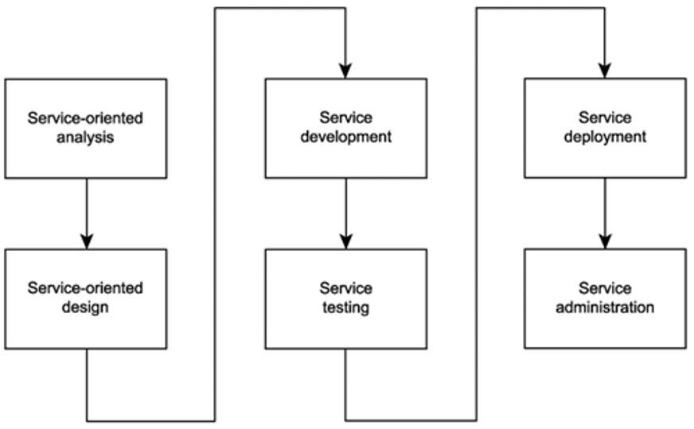
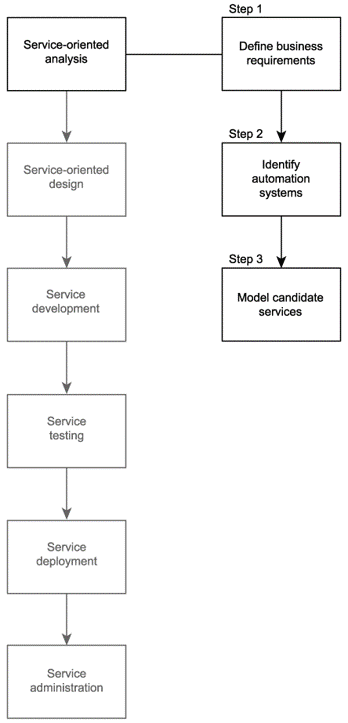
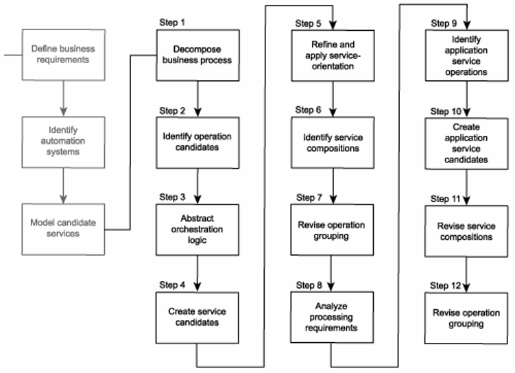
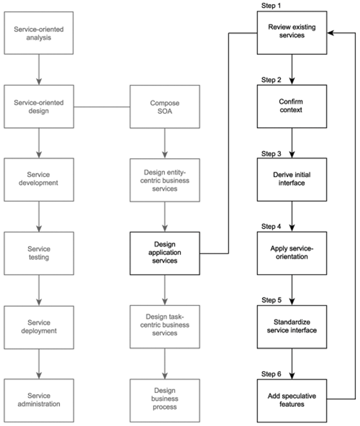

# Guided questions for Module 6

Service Engineering

[TOC]

最后考试前提示的复习点和 PPT 上提到的很不一样，下面使用的是最后考试前提示的问题。

## 1 What are three common SOA delivery strategies?

Different strategies exist for how to organize lifecycle stages to enable delivery of specialized service layers.

- Top-down
- Bottom-up
- Agile (meet-in-the-middle)

## 2 What are SOA delivery lifecycle phases?

## 3 What is the purpose of service-oriented analysis? What are the steps taken in this phase?

Service-oriented analysis goals:

- Define a preliminary set of **service operation candidates**.
- Group service operation candidates into logical contexts. These contexts represent **service candidates**.
- Define preliminary **service boundaries** so that they do not overlap with any existing or planned services.
- Identify encapsulated logic with **reuse** potential.
- Ensure that the context of **encapsulated** logic is appropriate for its intended use.
- Define any known preliminary **composition** models.

---

---

## 4 What happens in service-oriented design phase of an SOA delivery lifecycle?

## 5 What choices are made during service development?

The choice of programming language and development environment will determine the physical form services and orchestrated business processes take, in accordance with their designs.

## 6 Why do we apply service orientation in both, service analysis and design phases?

Experts from different domains participate in these two phases

- service oriented analysis: experts with **business** expertise participate in making decisions; decisions are made to fulfill business requirements;
- service oriented design: experts who understand the enterprise **technical** environments make sure that the design meets technical requirements.

## 7 One particular case

We have performed some steps of SOA analysis and design for one particular case - make sure to review the ppt slides from the lectures where we described this process in details and explained how and why these decisions were made:

- Are you able to perform the service analysis steps for the example scenario?
- Do you know how to perform each step when refining ? How to apply the service orientation principles? How to make the adjustments?
  - 你知道完善时如何执行每一步吗？如何应用面向服务原则？如何进行调整？
- Do you know how to apply reusability and autonomy principles to adjust the service candidates in our initial design?
  - 你知道如何在初始设计中应用可重用性和自治原则来调整服务候选吗?
- Are you able to perform the service design steps for the example scenario?