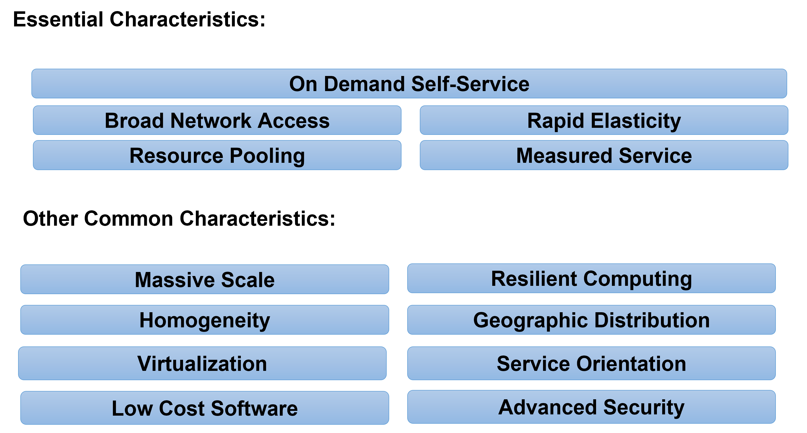

# Module 7 Topic 1

Hot topics in Service Computing - Cloud

Topic 1: Cloud Computing Overview

[TOC]

## 1 Cloud computing definitions

What is cloud computing?

definition (1):

Cloud computing is the delivery of different services through the Internet, which includes tools and applications like data storage, servers, databases, networking, and software.

---

definition (2):

Cloud computing is a general term for anything that involves delivering hosted services over the internet.

These services are divided into three main categories or types of cloud computing:

- infrastructure as a service (IaaS)
- platform as a service (PaaS)
- software as a service (SaaS)

---

definition (3):

Cloud computing is the **on-demand** availability of computer system resources, especially data storage (cloud storage) and computing power, **without direct active management by the user**.

Large clouds often have functions **distributed over multiple locations**, each location being a data center.

Cloud computing relies on **sharing of resources** to achieve coherence and typically using a "**pay-as-you-go**" model which can help in reducing capital expenses but may also lead to unexpected operating expenses for unaware users.

## 2 Cloud deployment models

Cloud deployment models (1):

- Public clouds
  - Provide their services on servers and storage on the Internet.
  - These are operated by third-party companies, who handle and control all the hardware, software, and the general infrastructure.
  - Clients access services through accounts that can be accessed by just about anyone.
- Private clouds
  - Are reserved for specific clientele, usually one business or organization.
  - The firm's data service center may host the cloud computing service.
  - Many private cloud computing services are provided on a private network.
- Hybrid clouds 
  - A combination of both public and private services.
  - This type of model allows the user more flexibility and helps optimize the user's infrastructure and security.

---

Cloud deployment models (2):

- Community cloud
  - It allows systems and services to be accessible by a group of organizations
  - It is a distributed system that is created by integrating the services of different clouds to address the specific needs of a community, industry, or business
  - The infrastructure of the community could be shared between the organization which has shared concerns or tasks
  - It is generally managed by a third party or by the combination of one or more organizations in the community
- Multi-cloud
  - Employing multiple cloud providers at the same time
  - It’s similar to the hybrid cloud deployment approach, which combines public and private cloud resources
  - Instead of merging private and public clouds, multi-cloud uses many public clouds
  - Improves availability of the services – when one cloud fails, another is available

## 3 Who uses cloud?

- The short answer is: everyone.
  - From your phone and your car to your smart watch and your favorite food delivery app, the cloud is everywhere.
- But cloud computing is especially powerful for businesses
  - Companies use it for routine tasks like
    - data protection
    - software development
    - data analytics
    - disaster recovery
    - virtual desktops
    - server virtualization
    - customer-facing applications

## 4 Cloud computing examples

- Tencent Meeting & VooV Meeting
- Rain Classroom - 雨课堂
- Salesforce
- AWS – Amazon Web Services
- EqualOcean
- Alibaba Cloud 阿里云

## 5 Cloud Computing Characteristics

## 6 Cloud computing origin

### 6.1 Origin of the name - why “cloud”?

Cloud as a symbol of Internet

- Recall our definition of cloud computing
- Cloud computing is a general term for anything that involves delivering hosted service over the **Internet**.
- The name “cloud computing” was inspired by the **cloud symbol** that’s often used to represent the **Internet in flow charts and diagrams**.

---

Cloud as a metaphor for virtual space

- In cloud computing, the information being accessed is found remotely in the cloud or a virtual space.

  - Companies that provide cloud services enable users to store files and applications on remote servers and then access all the data via the Internet.
  - This means the user is not required to be in a specific place to gain access to it, allowing the user to work remotely.

- **That virtual space becomes the cloud** —your data, work, and applications are available from any device with which you can connect to the Internet, anywhere in the world.

- Cloud computing metaphor: the group of networked elements providing services need not be individually addressed or managed by users; instead, **the entire provider-managed suite of hardware and software can be thought of as an amorphous cloud**.

  *amorphous - without a clearly defined shape or form*

### 6.2 Origin of the technology - evolution of cloud computing

- These technologies contributed to the making of cloud computing:
  - Time sharing
  - Global network
  - Virtualization
  - Web applications
  - Web services
  - …
- Apart from the above, other trends and technologies contributed to the development of cloud computing as well. You can read about them online and find research papers.

#### 6.2.1 Time sharing

In the 1950s, companies started to use large mainframe computers, but it was too expensive to buy a computer for each user.

So, during the late 1950s and early 1960s, a process called time sharing was developed to make more efficient use of expensive processor time on the central mainframe.

Time sharing enabled users to access numerous instances of computing mainframes simultaneously, maximizing processing power and minimizing downtime.

This idea represents **the first use of shared computing resources**, the foundation of modern cloud computing.

#### 6.2.2 Global network

The origins of delivering computing resources using a global network are rooted in 1969 when American computer scientist J.C.R. Licklider helped create the Advanced Research Projects Agency Network, the so-called precursor to the Internet.

Licklider's goal was to connect computers across the globe in a way that would enable users to access programs and information from any location.

#### 6.2.3 Virtualization

It refers to the process of **creating a virtual layer over the hardware** which allows the user to run multiple instances simultaneously on the hardware.

In the 1970s, cloud computing began taking a more tangible shape with the introduction of the first VMs (**virtual machines**), **enabling users to run more than one computing system within a single physical setup**.

The functionality of these VMs led to the concept of virtualization, which had a major influence on the progress of cloud computing.

It is the base on which major cloud computing services such as Amazon EC2, VMware vCloud, etc work on. Hardware virtualization is still one of the most common types of virtualization.

#### 6.2.4 Web Applications

In the 1970s and 1980s, Microsoft, Apple and IBM developed technologies that enhanced the cloud environment and advanced the use of the cloud server and server hosting.

Then, in 1999, Salesforce became the first company to **deliver business applications from a website**.

#### 6.2.5 Web Services

- In 2006, Amazon launched AWS, providing such services as **computing and storage in the cloud**.
  - Simple Storage Service (S3) 
  - Elastic Compute Cloud (EC2)
- These products pioneered the usage of **server virtualization** to deliver IaaS at a cheaper and **on-demand pricing basis**.
- Following suit, the other major tech players, including Microsoft and Google, subsequently launched their own cloud offerings to compete with AWS.

## 7 Cloud computing advantages

### 7.1 Cost savings

#### 7.1.1 Money savings

##### 7.1.1.1 Minimize up-front IT infrastructure costs

Companies can swap costly server centers and IT departments for fast Internet connections, where employees interact with the cloud online to complete their tasks.

- Before cloud computing
  - Companies were **required to purchase, construct, and maintain costly information management technology and infrastructure** - server centres
  - a database server, mail server, networking, firewalls, routers, modem, switches, QPS (Query Per Second means how much queries or load will be handled by the server), configurable system, high net speed,
  - the maintenance engineers
- After cloud computing
  - They **don't have to invest in hardware, facilities, utilities or building large data centers** to accommodate their growing businesses. 
  - Companies **don't need large IT teams** because they can rely on the expertise of their cloud providers' teams.

##### 7.1.1.2 Minimize hardware cost

Traditional desktop software runs on desktop PC and demands high processing power and hard disk space– costly

Running cloud computing’s web-based applications does not require a high-powered and high-priced computer

- **PC can be less expensive**, with a smaller hard disk, less memory, more efficient processor...

##### 7.1.1.3 Minimize software cost

Instead of purchasing expensive software applications, companies can get most of wheat they need in the cloud

- Many cloud computing applications are available for free

Instant software updates without high upgrade costs

- When the application is web-based, updates happen automatically available the next time you log into the cloud
- When you access a web-based application, you get the latest version without needing to pay for or download an upgrade

##### 7.1.1.4 Minimize downtime cost

Cloud computing also cuts costs related to downtime

- Downtime - the time during which a computer or IT system is unavailable, offline or not operational

Since downtime rarely happens in cloud computing, companies don't have to spend time and money to fix any issues that might be related to downtime

#### 7.1.2 Time savings

##### 7.1.2.1 Minimize application development time

Cloud computing allows enterprises to **get their applications up and running faster**, with improved manageability and less maintenance.

##### 7.1.2.2 Minimize management time

Cloud computing enables IT teams to **more rapidly** adjust resources to meet fluctuating and unpredictable demand providing burst computing capability: high computing power at certain periods of peak demand.

### 7.2 Increased productivity

#### 7.2.1 Improved data storage

Unlimited storage capacity

- Cloud computing offers virtually limitless storage.

Increased data reliability

- Even if your personal computer crashes, all your data is still out there in the cloud, still accessible.

#### 7.2.2 Data and workload mobility

Storing information in the cloud means that users can access it from anywhere with any device with just an internet connection.

Remote employees are able to stay up to date with co-workers and customers.

#### 7.2.3 Improved collaboration

Shared storage:

- Sharing documents leads directly to better collaboration
- Multiple users can collaborate easily on documents and projects
- Colleagues can work together on documents housed in the cloud, with everyone able to access the same files and edit them in real-time.

Improved document format compatibility.

- You do not have to worry about the documents you create on your machine being compatible with other users' applications or OSes

- There are potentially no format incompatibilities when everyone is sharing documents and applications in the cloud.

Document version management

- Cloud collaboration eliminates the confusion caused by having multiple versions of the same documents or the trials of attempting to merge resulting files.

Space and time decoupling

- Cloud computing enables teams to work together and achieve their shared goals **without being together physically in the workplace**.
- Team members can view and edit the documents **at any time**.

### 7.3 Business continuity and disaster recovery

All organizations worry about data loss. Storing data in the cloud guarantees that the data can be recovered even if

- their local devices, e.g., laptops or smartphones, are inoperable

- in the event of emergencies, such as natural disasters or power outages

## 8 Cloud computing disadvantages

### 8.1 Cloud security

Security is often considered the greatest challenge facing cloud computing, especially when it comes to sensitive medical records and financial information.

When relying on the cloud, organizations risk

- data breaches
- hacking of APIs and interfaces
- compromised credentials
- authentication issues

Furthermore, there is a lack of transparency regarding how and where sensitive information entrusted to the cloud provider is handled.

Security demands careful attention to cloud configurations and business policy and practice.

### 8.2 Cloud performance

Performance -- such as latency -- is largely beyond the control of the organization contracting cloud services with a provider.

Network and provider outages can interfere with productivity and disrupt business processes if organizations are not prepared with contingency plans.

### 8.3 Limited customization options

Cloud computing is **cheaper** because of economics of scale, but it offers **fewer options** at a much cheaper price.

A restaurant with a limited menu is cheaper than a personal chef who can cook anything you want.

### 8.4 Cost unpredictability

Pay-as-you-go subscription plans for cloud use, along with scaling resources to accommodate fluctuating workload demands, can make it **tough to predict final costs**.

### 8.5 Lack of capability and expertise

With cloud-supporting technologies rapidly advancing, organizations are struggling to keep up with the growing demand for tools and employees with the proper skill sets and knowledge needed to architect, deploy, and manage workloads and data in a cloud.

### 8.6 Compliance with industry laws

When transferring data from on-premises local storage into cloud storage, it can be difficult to manage compliance with industry regulations through a third party.

It's important to know where data and workloads are actually hosted in order to maintain regulatory compliance and proper business governance.

### 8.7 Complicated cloud migration

The process of moving applications and other data to a cloud infrastructure often causes complications.

Migration projects frequently take longer than anticipated and go over budget.

### 8.8 IT governance issues

Cloud infrastructure is completely owned, managed, and monitored by the service provider, so the cloud users have less control over the function and execution of services within a cloud infrastructure.

This can make it challenging to properly manage risks and security, IT compliance and data quality.

### 8.9 Vendor lock-in

Often, **switching between cloud providers** can cause significant issues. 

- technical incompatibilities
- legal and regulatory limitations
- substantial costs incurred from sizable data migrations

## 9 Summary

Cloud computing is the **delivery of different services through the Internet**.

- The service types include software, infrastructure, platform and many others
- They can be deployed in private clouds and public clouds, as well as their combination

Cloud computing offers its users many **advantages**, but it also has **disadvantages** and there is an ongoing research to solve these problems.