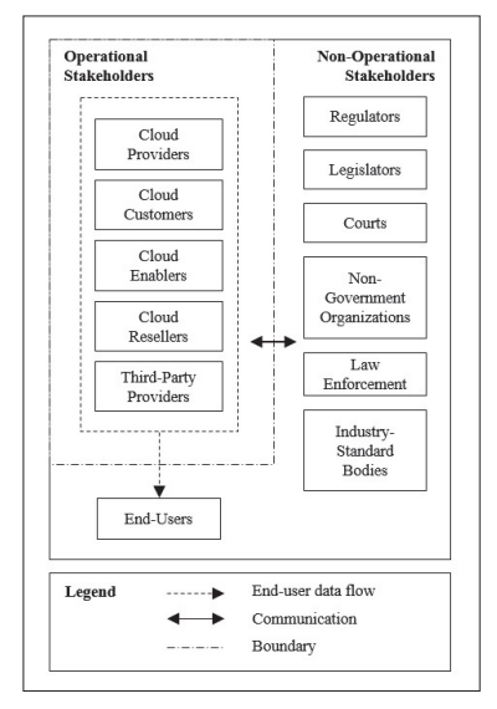

# Module 7 Topic 3

Hot topics in Service Computing - Cloud

Topic 3: Cloud Stakeholders, Cloud Standardization, Cloud Computing Reference Architecture

[TOC]

## 1 What is a stakeholder?

利益相关者

## 2 Who are cloud stakeholders?

## 3 Operational stakeholders

Stakeholders who perform and conduct cloud operations.

- Cloud providers
- Cloud customers
- End-users
- Cloud enablers
- Cloud resellers
- Third-party providers

## 4 Non-Operational Stakeholders

- Cloud computing standards and laws in China

- International cloud computing standards

## 5 Cloud Computing Reference Architecture

### 5.1 Architecture

### 5.2 Reference Architecture

### 5.3 Cloud Computing Reference Architecture (CCRA)

## 6 Service deployment models

A cloud infrastructure may be operated in one of the following deployment models

- public cloud
- private cloud
- community cloud
- hybrid cloud

The differences are based on how exclusive the computing resources are made to a Cloud Consumer.

## 7 Summary

- Standardization of cloud computing
  - Standards ensure that goods or services produced in a specific industry come with consistent quality
  - Many standards and specifications related to Cloud Computing have been developed by standards developing organizations
  - Foundational standards that deal with vocabulary and reference architecture are essential for developing other standards.
- Cloud Computing Reference Architecture
  - Cloud Computing Reference standard defines the basic building blocks—architectural elements and their relationships—which make up the cloud
  - Cloud computing reference models were proposed by multiple cloud organizations and standard setting bodies
- Cloud computing standards and laws in China
  - China has developed a number of standards and laws that regulate the adoption of cloud computing technology in different aspects (security, privacy, financial and others)
  - Chinese parties collaborate with international standard setting bodies