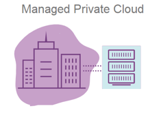
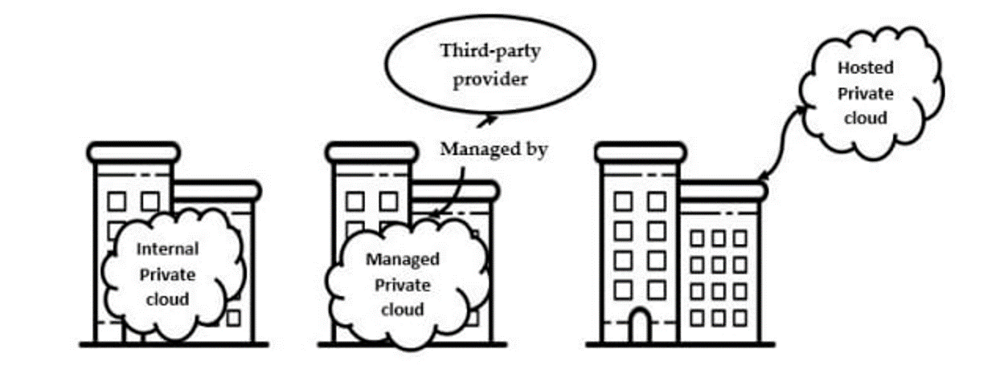

# Module 7 Topic 5

Hot topics in Service Computing - Cloud

Topic 5: Private cloud platform construction

[TOC]

## 1 Private cloud

## 2 Private cloud vs Public cloud

## 3 Single-tenant environment

## 4 How are the resources hosted in private clouds?

资源如何托管在私有云中？通过一个样例来引入。

- Option 1 – private data center
  - Organization's on-premises data center (本地数据中心)
    - Owned and hosted on organization’s premises
    - Managed by organization
- Option 2 – public cloud
  - Hosted by another organization on shared resources
- Option 3 – private cloud
  - Hosted on resources dedicated to the organization (not shared)

所以可以看出私有云是私人控制和访问，但**不一定**是像自建数据中心那样自己管理的。

## 5 On-Premise/Internal private cloud

Motivation

- Better utilization of resources
- Maintain **full control**

The private cloud is **based on resources and infrastructure already present in an organization's on-premises data center**

The organization/enterprise hosts a cloud environment internally

---

In this model, who is:

- Cloud provider/service provider?
  - Infrastructure is owned and managed by the enterprise’s own IT team
  - Enterprise IT becomes the service provider
- Customer/user/cloud tenant?
  - Enterprise’s business units use resources hosted in the private cloud
  - Business units are cloud tenants

---

On-Premise/Internal private cloud benefits: (?)

- Higher cost
  - Can include the cost of purchasing and installing new hardware and software and the cost of managing it (which may involve hiring additional IT staff.)
- Limited flexibility
  - once an organization invests in hardware and software for its private cloud, adding capacity or new capabilities requires additional purchases

## 6 Managed Private Cloud

Responsibility for managing and maintaining the infrastructure is outsourced to **a third-party service provider**.

The physical hardware:

- usually resides in the service provider’s data center
- vendors also offer management services for infrastructure located in an enterprise’s own data center

The provider maintains every part of the cloud for the enterprise, including the deployment of additional services like identity management and storage.

A good alternative for companies that don't have the resources to run private cloud systems on their own.

---

- Example 1 - Oracle Private Cloud at Customer
  - Infrastructure managed by Oracle but deployed inside inside customer own data centers.
- Example 2 - Atlantic.Net

---

Service offered in managed private cloud

- System Environment
- Clustering
- VM Provisioning
- System Updates
- Replication and Failover
- Advanced Certifications
- Advanced Monitoring
- Additional VM Services
- Managed Private Cloud Infrastructure

## 7 Hosted private cloud

The private cloud is based on new, separate infrastructure, which is provided by a third-party organization.

The environment where infrastructure is both hosted and managed by the cloud provider itself.

---

How hosted private cloud works:

- The cloud provider allocates a particular server to a particular organization
  - The server’s resources are not shared among other organizations
- The organization only uses the resources and can access them as per the demand
- The cloud provider is responsible for managing, updating, and configuring the hardware, software, and network

---

Hosted private vs public cloud:

From the customer perspective both options have some similarity- the service provider configures the network, maintains the hardware and updates the software.

However, in a hosted private cloud environment, the servers are not shared with other organizations.

---

Hosted private cloud benefits:

- Hosted private cloud vendors offer cloud servers in their own data centers and are also responsible for security management
- Users get access to
  - additional resources
  - a support team
  - high-demand scalability options
  - a user-friendly dashboard to assist in server management

## 8 Internal vs Managed vs Hosted

## 9 Virtual private cloud

- A secure private cloud that is hosted remotely by a public cloud provider.
- The single-tenant environment is enabled solely using virtualization software.
- A walled-off environment within a public cloud that allows an organization to run their workloads in isolation from every other user of the public cloud.
- Even though the server is shared by other organizations, the virtual logic ensures that a user's computing resources are private.

---

Virtual private cloud benefits:

- VPC customers can benefit from the public cloud’s
  - Resource availability
  - Scalability
  - Flexibility
  - Cost-effectiveness
- Retaining much of the security and control of private cloud
  - The ability to define and control a logically isolated space in the public cloud
  - Offers the private cloud’s enhanced security within a multi-tenant environment

---

How to create a virtual private cloud - example

VMware vCloud® Air™ Virtual Private Cloud OnDemand

- Create an Account
- Create a Virtual Machine
- View and Monitor Resource Usage

## 10 Types of private clouds

- Virtual
- Hosted
- Managed

- On-premise/Internal

All private clouds offer **an isolated environment**.

Different types of private clouds are classified into categories based on how they are hosted and how much management they receive from the provider.

## 11 Constructing a private cloud

## 12 Private Cloud Solutions

## 13 Choosing cloud deployments

Making the choice to adopt private cloud:

- Choosing private cloud over public mainly boils down to two things
  - budgeting (choosing CAPEX over OPEX) (选择资本支出而不是运营支出)
  - control (in terms of security and privacy)

---

Budgeting:

- Capital Expenditures (CapEx): Purchases of significant goods or services that will be used to improve a company’s performance in the future.
  - Manufacturing plants, equipment, and machinery
  - Building improvements
  - Computers
  - Vehicles and trucks
  - …
- Operating Expenses (OpEx): The costs that a company incurs for running its day-to-day operations.
  - Rent and utilities
  - Wages and salaries
  - …

### 13.1 Budgeting issues

- Which cloud costs more?

  - You usually pay for what you use in a public cloud, though some public clouds don't charge tenants.

  - Whoever set up a private cloud is usually responsible for purchasing or renting new hardware and resources to scale up.

  - Hybrid clouds can include any on-premises, off-premises, or provider's cloud to create a custom environment that suits your cost requirements.

- Which cloud has the best resources?
  - That depends on how you want to spend money. Do you want to incur capital expenses (CapEx) or operating expenses (OpEx)? This is the classic scale-up vs. scale-out question.
  - Public cloud users seem to have unlimited access to resources, but accessing those resources is usually an operational expense.
  - Deploying more private cloud resources requires buying or renting more hardware—all capital expenses.
  - Hybrid clouds give you the option of using operating expenses to scale out or capital expenses to scale up.

### 13.2 Control issues

Which cloud is safest?

- Public clouds
  - Tend to have a wider variety of security threats due to multi-tenancy and numerous access points
  - Often split security responsibilities
    - infrastructural security can be the provider’s responsibility
    - workload security can be the tenant's responsibility
- Private clouds
  - Are thought to be more secure because workloads usually run behind the user's firewall
  - All depends on how strong the user’s own security is
- Hybrid cloud
  - security is made up of the best features of every environment
  - users and admins can minimize data exposure by moving workloads and data across environments based on compliance, audit, policy, or security requirements

## 14 Summary

- All private clouds offer an isolated environment but differ on how they are hosted and how much management they receive from the provider.
- Private clouds are based on the same technologies as public and hybrid clouds.
- Before adopting cloud technology, companies need to first develop a migration strategy in which they define their needs, expectations, and goals.