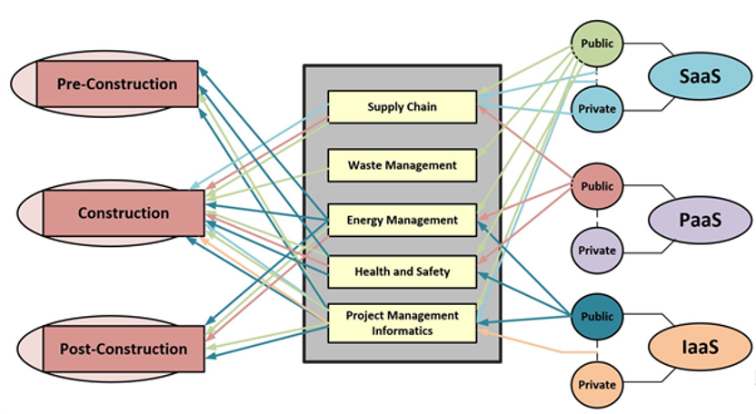
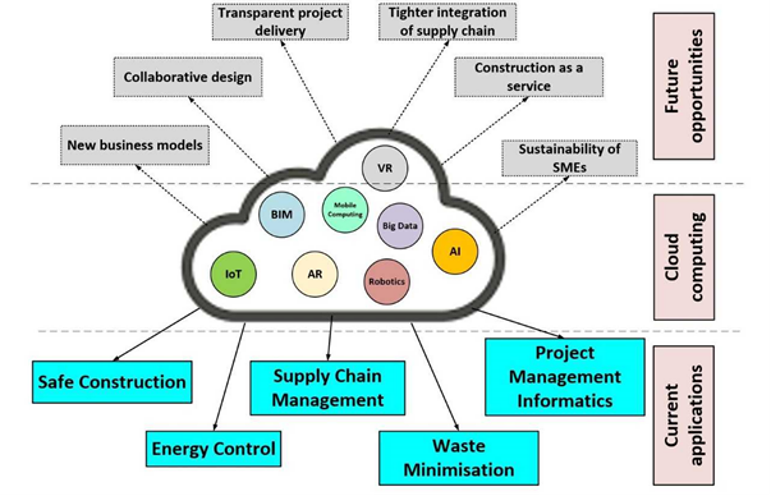

# Module 7 Topic 7

Hot topics in Service Computing - Cloud

Topic 7: Cloud computing applications in construction industry

[TOC]

## 1 The need for cloud computing in the construction industry

- Economic Benefits
- On-demand Scalability of Computing Resources
- Secured Platform
- Massive Storage
- Facilitating Collaborative Practice

## 2 Use cases of cloud computing in construction industry

## 3 Challenges of cloud adoption by construction industry

- Latency
- Trust, Data Privacy and Security
- Data Availability
- Data Governance
- Poor Broadband Connectivity of Construction Sites
- Cost Implication of Long-Term Use
- Dark Data
- Threats of Edge Computing and Other Associated Technologies

## 4 Summary

